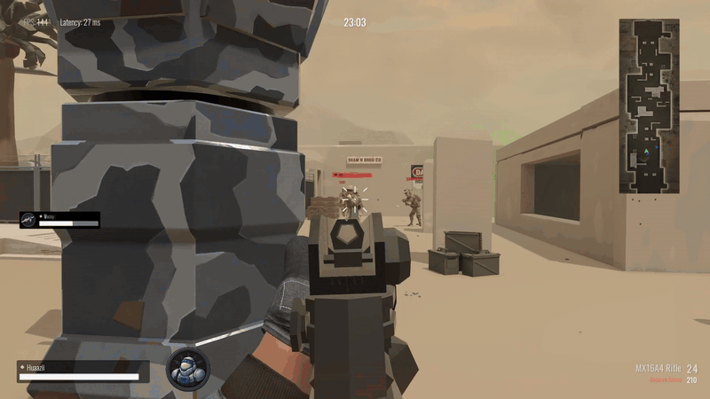
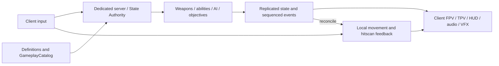
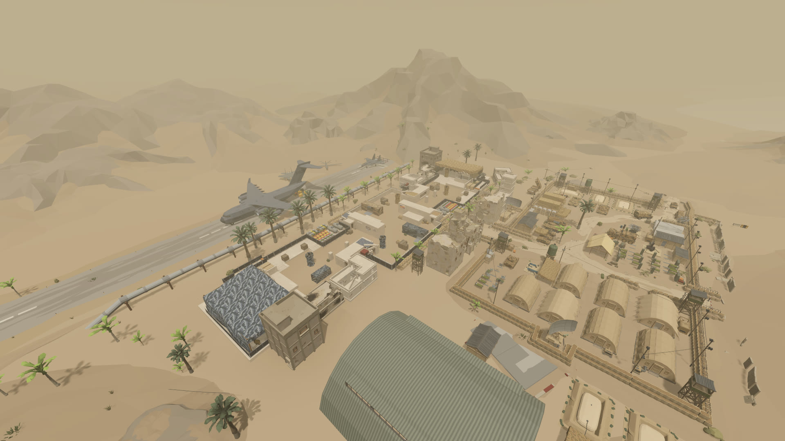

# Operation Aetherium

### First-person combat meets MOBA objective progression

**Huaazii · Independent Developer · Unity 2022.3 / C# / Photon Fusion 2 / URP · Windows PC**

[中文](README.zh-CN.md) · [Gameplay footage](docs/demo.md) · [Architecture](docs/architecture.md) · [Knowledge map](docs/knowledge-map.md) · [Engineering cases](docs/cases/README.md) · [Source](src/README.md)

*Aiming, firing, reload and squad combat around defensive structures.* [Gameplay gallery](docs/demo.md)

Operation Aetherium is a **3v3 multiplayer MOBA / FPS** set in a desert military outpost. Alpha and Omega compete for Aetherium, an energy crystal beneath the battlefield. First-person gunplay and class abilities create openings; AI minions sustain lane pressure; defensive structures shape the advance toward the opposing core.

I independently develop the **Desert Storm multiplayer systems and their integration**: client / dedicated-server session flow, authoritative combat, player prediction, class abilities, minions and objectives, gameplay UI, content configuration and FPV / TPV presentation.

## Implemented gameplay

| System | In the game |
|---|---|
| Squad combat | Movement, aiming, hitscan weapons, reload phases, damage, death and respawn |
| Heavy | Timed shield state and damage reduction |
| Medic | Serum throws and areas that heal allies and damage enemies |
| Rocket | RPG equipment, network projectiles and explosion feedback |
| Battlefield progression | Minion waves, authority-side navigation, defensive objectives and core-based victory |
| Base class changes | Change class inside the team's base zone while retaining combat state and shared ability cooldown |
| Match flow | Room admission, team / class selection, settlement and return to the waiting room for another round |

Team, class and match seat have separate identities. Typed definitions and catalog mappings connect the current roster to shared spawning, inventory, health and presentation systems. [Gameplay and world](docs/gameplay.md)

## Architecture

A multiplayer action game has two immediate requirements: the local player needs feedback when acting, and all participants need a common combat result. The project connects **input intent → server simulation → replicated results → client presentation**, with local movement prediction and hitscan feedback prediction.

The [architecture](docs/architecture.md) describes ownership, assembly dependencies, connection readiness and round isolation. The [system contracts](docs/system-contracts.md) identify the responsibilities and constraints behind those boundaries.

## Engineering highlights

| Work | Mechanism and engineering value | Implementation |
|---|---|---|
| Dedicated-server sessions | UI-free room authority, explicit admission, persistent seats and round-scoped cleanup support a server lifetime spanning multiple matches | [Server and room lifecycle](docs/cases/dedicated-server.md) |
| Responsive combat | Lag-compensated authoritative hitscan; immediate local hitscan feedback reconciled by shot sequence; deterministic aim recoil shared by authority and prediction | [Networked combat](docs/cases/networked-combat.md) |
| Safe class replacement | Server validates source identity, team zone, round and version; transfers health ratio, equipment, effects and statistics before committing the new player binding | [Base class change](docs/cases/class-change.md) |
| Weapon presentation | Equip readiness, explicit reload phases and shot-owned item IDs coordinate FPV / TPV animation, audio and one-use equipment | [Presentation lifecycle](docs/cases/presentation-lifecycle.md) |
| Bounded runtime work | Capped visual pools, cancellable prewarm, reusable queries and change-driven UI reduce repeated creation and scanning | [Runtime resource management](docs/cases/runtime-resources.md) |
| Content and battlefield rules | Typed content mappings, shared combat targets, authority-side navigation and separate objective / protection states organize gameplay integration | [Content](docs/cases/content-architecture.md) · [MOBA](docs/cases/moba-battlefield.md) |

## Desert Storm

Lanes, cover and defensive structures organize the battlefield for player combat and AI navigation. [Battlefield systems](docs/cases/moba-battlefield.md)

## Repository

The [architecture](docs/architecture.md) and [knowledge map](docs/knowledge-map.md) connect state ownership, action identity and resource lifetimes to the implemented game. [Selected C# source](src/README.md) exposes the contracts, configuration and runtime mechanisms behind those systems.

[Project contribution and credits](CREDITS.md) · [Copyright and usage](COPYRIGHT.md)
