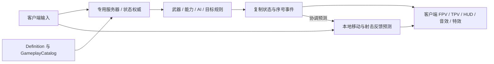

# Operation Aetherium

### 第一人称射击与 MOBA 目标推进结合的 3v3 联机对战

**Huaazii｜独立开发｜Unity 2022.3 / C# / Photon Fusion 2 / URP｜Windows PC**

[English](README.md) · [联机实录](docs/demo.zh-CN.md) · [整体架构](docs/architecture.zh-CN.md) · [技术知识图谱](docs/knowledge-map.md) · [技术案例](docs/cases/README.md) · [精选源码](src/README.md)

*瞄准、射击、换弹，以及防御结构附近的小队交战。* [完整玩法展示](docs/demo.zh-CN.md)

在近未来的沙漠军事哨站，Alpha 与 Omega 围绕地下能源晶体 Aetherium 展开争夺。玩家通过第一人称射击与兵种协作取得交战优势，配合 AI 兵线突破防御结构，最终摧毁敌方核心。

我独立开发 **Desert Storm 联机系统与玩法整合**，负责客户端与专用服务器会话流程、权威战斗、本地预测、兵种能力、小兵与结构目标、游戏 UI、配置架构及 FPV / TPV 表现桥接。

## 已实现玩法

| 系统 | 游戏中的内容 |
|---|---|
| 小队交战 | 移动、瞄准、命中扫描武器、阶段化换弹、伤害、死亡与复活 |
| Heavy | 有持续时间的护盾状态与减伤 |
| Medic | Serum 投掷与区域效果，治疗友方、伤害敌方 |
| Rocket | RPG 特殊装备、网络投射物与爆炸反馈 |
| 战场推进 | 小兵波次、权威侧导航、防御目标与核心胜负条件 |
| 基地换兵种 | 在己方基地范围内更换兵种，继承战斗状态和共享技能冷却 |
| 对局流程 | 房间准入、阵营与兵种选择、结算，以及回到等待房间开始下一局 |

阵营、职业和对局席位分别建模。类型化定义与 GameplayCatalog 将兵种接入共用的角色生成、库存、生命和表现系统。[玩法与世界观](docs/gameplay.md)

## 整体架构

联机动作游戏需要同时满足本地操作响应和共享战斗结果一致。项目以 **输入意图 → 服务端仿真 → 复制结果 → 客户端表现** 组织职责，本地移动预测与命中扫描反馈预测提供即时响应。

[架构文档](docs/architecture.zh-CN.md) 展开状态所有权、程序集依赖、连接就绪和轮次隔离。[系统契约](docs/system-contracts.md) 对应各模块的职责、关联与设计约束。

## 技术实现

| 工作 | 实现机制与工程价值 | 详细说明 |
|---|---|---|
| 专服与会话 | 不依赖 UI 的房间权威、显式准入、持久席位与按轮次清理，让同一服务器承载连续对局 | [服务器与房间](docs/cases/dedicated-server.md) |
| 联机射击 | 回溯命中由权威裁决；本地即时反馈按射击序号协调；确定性瞄准后坐力用于权威与预测 | [战斗系统](docs/cases/networked-combat.md) |
| 局内换兵种 | 服务端核对请求来源、阵营区域、轮次及版本，转移血量比例、装备、效果与统计后提交角色绑定 | [兵种替换](docs/cases/class-change.md) |
| 武器表现整合 | 装备就绪门控、明确换弹阶段和射击所属物品 ID，协调 FPV / TPV、音效与一次性装备消耗 | [表现生命周期](docs/cases/presentation-lifecycle.md) |
| 运行时资源管理 | 有上限的特效池、可取消预热、复用查询与按变化刷新的 UI，减少重复创建和扫描 | [资源与更新成本](docs/cases/runtime-resources.md) |
| 内容与战场规则 | 类型化资源映射、共同战斗目标接口、权威导航，以及独立的目标前置条件和防护状态 | [内容配置](docs/cases/content-architecture.md) · [MOBA 系统](docs/cases/moba-battlefield.md) |

## Desert Storm

通路、掩体与防御结构为玩家交战和 AI 导航提供共同的空间上下文。[战场系统](docs/cases/moba-battlefield.md)

## 仓库内容

[整体架构](docs/architecture.zh-CN.md)与[技术知识图谱](docs/knowledge-map.md)将状态所有权、动作身份和资源生命周期连接到游戏实现。[C# 源码节选](src/README.md)展示相关契约、配置与运行时机制。

[项目贡献与资源归属](CREDITS.md) · [版权与使用范围](COPYRIGHT.md)
