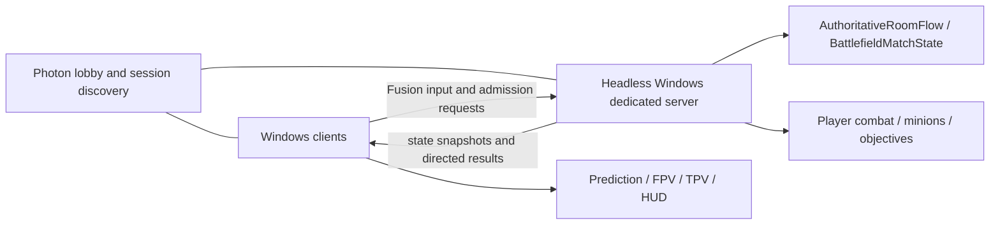
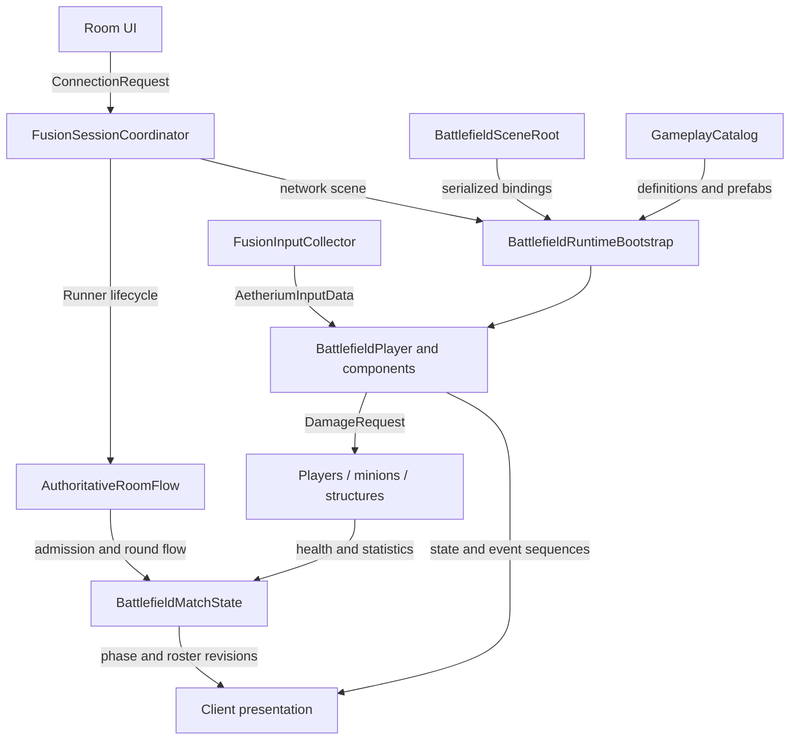
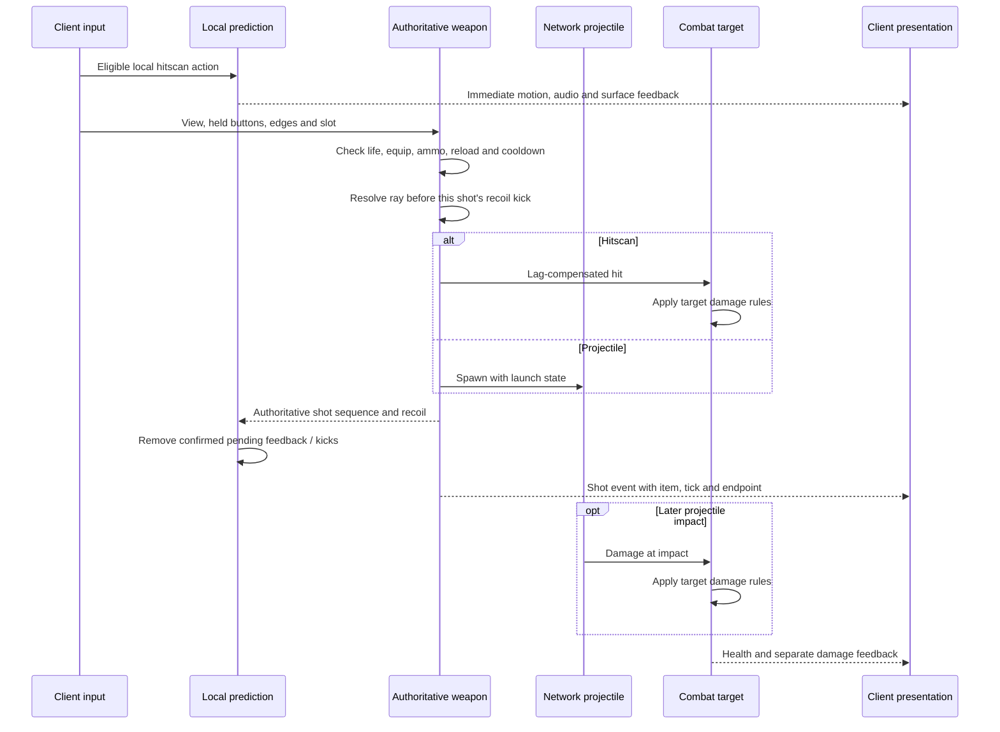
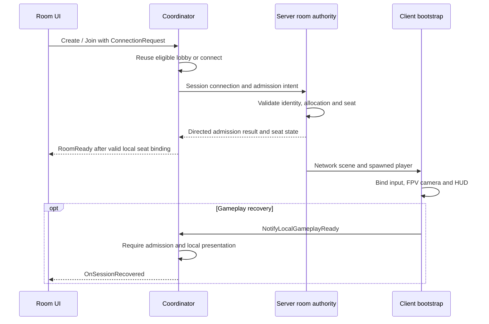
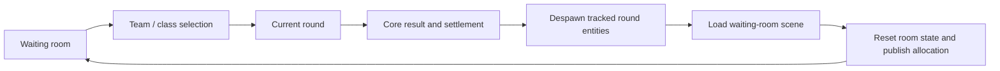
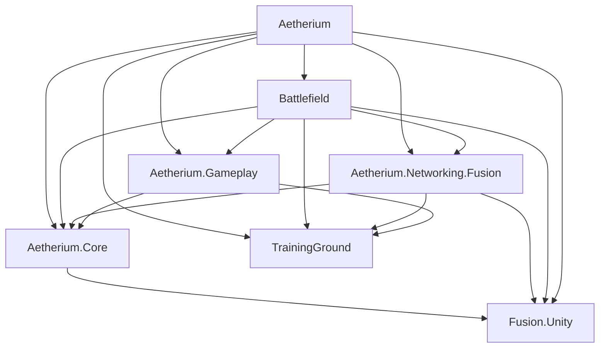

# Architecture

[中文](architecture.zh-CN.md) · [Knowledge map](knowledge-map.md) · [System contracts](system-contracts.md) · [Project](../README.md)

Operation Aetherium uses Photon Fusion 2 with a **client / dedicated-server topology**. The server owns shared combat and room state. Clients submit input, predict local movement and selected hitscan feedback, and present replicated results.

The architecture gives each state a writer, each action a clock and identity, and each resource an owning lifetime.

## Network topology

Photon service connection and the route to the game server are distinct concerns. The coordinator controls connection attempts; the actual game route can be direct or relayed. Server admission confirms the room seat after transport connection.

## Runtime composition

The room layer owns admission and match transitions without depending on a UI instance. The scene root supplies authored references. Bootstrap joins scene, session and content context, spawns players and maintains their bindings. Movement, inventory, weapons, health and abilities have separate components; presentation consumes their outputs.

## State ownership

| State | Owner / writer | Consumers |
|---|---|---|
| Input buttons, edges and absolute view | Local input collector | Fusion simulation and local feedback |
| Movement | Server state authority with local input-authority prediction | Correction and remote motion |
| Ammo, reload, cooldown, health and ability consumption | State-authoritative gameplay components | Replicated state and UI |
| Accepted shot and permanent aim recoil | Authoritative weapon controller | Damage query, client recoil reconciliation and presentation |
| Pending local hitscan feedback and recoil kicks | Local prediction layer | Immediate feedback until authoritative sequences reconcile it |
| AI decisions, navigation and objectives | Server state authority | Replicated motion, attacks and objective display |
| Seats, admission, class-change version and round | Authoritative match state / room flow | Registration, spawning, UI and recovery |
| Camera, animation, sound, VFX and display caches | Local presentation | Each client's visible result |
| Parameters and resource mappings | Authored definitions and catalog | Runtime setup and lookup |

## Combat data flow

[AetheriumInputData](../src/Core/Models/AetheriumInputData.cs) separates held buttons from accumulated press / release edges. Movement and aiming share absolute yaw / pitch. The authoritative hitscan ray uses the eye origin and gameplay view; authored muzzle bindings provide the visible origin. Trigger colliders are excluded from shot queries, and self-filtering uses the shooter's own subtree.

Accepted shots seed deterministic spread. [WeaponAimRecoil](../src/Core/Models/WeaponAimRecoil.cs) samples the gameplay kick from weapon identity and shot sequence, applies the ADS scale and clamps pitch. The authority resolves a shot's ray before adding its kick. Local pending kicks are combined with the latest authoritative offset; confirmation removes kicks already accounted for, and recoil generation identifies resets.

### Persistent state and transient events

Ammo, health and timers describe the current state. Shots and hits describe occurrences. The implementation uses separate **16-entry shot and damage-feedback rings**, each with sequence cursors. Delayed projectile damage therefore has its own feedback identity.

The [shot event contract](../src/Battlefield/Player/WeaponPresentationEvent.cs) retains the firing item, shot tick, ammo result and ray. Playback uses that historical item even if inventory has already switched. Sequence windows bound traversal; gap diagnostics record overwritten history. The rings are recent playback windows, while persistent state retains gameplay results.

Local hitscan prediction covers eligible equipped weapons, local cadence and an ammo-debt check. It produces motion, audio, tracers and surface feedback. Authority still owns damage and hit confirmation. Both prediction-first and confirmation-first paths check consumed sequences, so local feedback has a defined identity in either ordering.

### Weapon phases and presentation

Equip has separate resource readiness and firing readiness. Weapon definitions supply the firing threshold; authority timers and the FPV bridge both gate firing. A switch retains the longer of outgoing shot recovery and incoming equip lock.

Reload publishes explicit Started / Applied / Complete / Cancel phases. Serum preparation, release and follow-through lock switching; release captures launch origin and direction. For confirmed actions arriving while a rig is equipping, the bridge retains the latest applicable motion for that rig and keeps sound at confirmation time. Mount changes, death, loss of input authority and session exit clear pending work. [Presentation case](cases/presentation-lifecycle.md)

[DamageRequest / DamageResult](../src/Core/Models/DamageRequest.cs) and [IFusionCombatTarget](../src/Core/Interfaces/IFusionCombatTarget.cs) connect attacks to players, minions and structures while leaving entity-specific rules with each target.

## Admission, connection and recovery

[ConnectionRequest](../src/Core/Interfaces/ConnectionRequest.cs) gives one user action an operation ID, a monotonic deadline, cancellation, progress stages and a single terminal outcome. Its current policy allows at most two attempts inside a 60-second total budget, partitioned into transport and admission budgets. The deadline applies across transport, admission and retry work.

The coordinator owns a healthy lobby connection and can hand its Runner into room entry. Retry classification separates network failures from business rejection and intentional cancellation. Protocol / port settings are built per attempt. Operation ID, attempt and Runner generation let asynchronous completions be checked against the lifetime they belong to.

A connection token identifies the returning participant; PlayerRef identifies the current transport peer. Seat reservations and recovery readiness coordinate those identities. The coordinator owns transport ordering; the room layer provides seat handshakes through a contract. [Session case](cases/session-lifecycle.md)

## Round and player lifetimes

The server retains the room across matches. Allocation state controls whether it is idle, claimed, reserved or resetting. Allocation epoch, Runner identity and RoundId scope admission and match work to their intended lifetimes.

The room-return flow checks ownership before and after asynchronous scene loading. RoundSpawnLedger tracks round-owned objects for cleanup, so player, minion and projectile lifetimes can be handled separately from the server process. Room reset is gated on the waiting scene becoming active. [Dedicated-server case](cases/dedicated-server.md)

Base class changes are an in-round player replacement. The server validates identity, RoundId, class-change version, life, team zone, out-of-combat timer and action / cooldown gates. Bootstrap stages the replacement, transfers state, commits the seat and player-object bindings, then despawns the old actor. [Class-change case](cases/class-change.md)

## AI and objective progression

FusionMinion combines authority-side target selection and combat decisions with NavMesh movement. Waypoints supply progression goals; navigation executes movement; replicated velocity drives remote animation. Target validity, distance and line of sight are separate checks.

FusionStructure separately maintains objective prerequisites and combat / protection state. FusionObjectiveRegistry resolves objective IDs. Towers participate in targeting and aggro; core destruction supplies the match outcome. [MOBA case](cases/moba-battlefield.md)

## Content, assemblies and resources

GameplayCatalog maps team / class pairs, item IDs, ability IDs and network content IDs to authored definitions and prefabs. Serialized lists support editing; dictionaries serve runtime lookups. WeaponDefinition holds simulation and presentation timing, including recoil and equip readiness. [Content case](cases/content-architecture.md)

Arrows below mean **assembly references**. Engine and integration packages are summarized beneath the graph.

| Assembly | Responsibility |
|---|---|
| Aetherium.Core | IDs, contracts, definitions and catalog; uses Fusion data types |
| Aetherium.Networking.Fusion | Session coordination, connection policy, input and player registration |
| Battlefield | Player simulation, combat, room / match authority, AI and bootstrap |
| Aetherium.Gameplay | Gameplay and presentation adapters |
| Aetherium | Scene and UI integration across systems |
| TrainingGround | Integrated FPS framework foundation; [credits](../CREDITS.md) |
| Editor / test assemblies | Authoring, binding and build tools; focused verification |

Gameplay integration references Fusion, Input System, animation, UI and URP packages where needed. Assembly references make the engine and integration dependencies explicit.

Scene-owned impact and transient visual pools cap retained instances and cancel prewarm on disable. Reused physics buffers, cached bindings and sequence / revision checks bound repeated work. Dense Serum queries use a complete fallback when the reusable buffer reaches its cap. [Resource case](cases/runtime-resources.md)

## Build and lifecycle boundaries

DedicatedServerBuildTools produces separate Windows Player and Server subtargets from the enabled build scenes and restores editor settings afterward. Server tooling supplies configurable launch, stop, readiness inspection, firewall and autostart management. Process identity and build compatibility define the deployment boundary.

| Stage | Responsibility |
|---|---|
| Awake / OnEnable | Local references and registrations |
| Spawned | Network context, authority initialization and presentation baseline |
| FixedUpdateNetwork | Authority / prediction simulation and TickTimers |
| Render / local frame stages | Consume snapshots, reconcile feedback and present |
| Despawned / OnDisable / OnDestroy | Unsubscribe, cancel pending work and release owned resources |

[System contracts](system-contracts.md) connect these responsibilities to their inputs, outputs and lifetime rules. [Selected source](../src/README.md) exposes the corresponding implementation.
