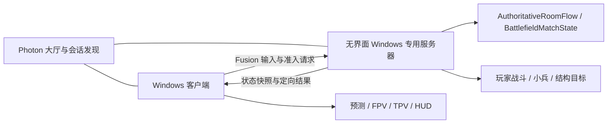
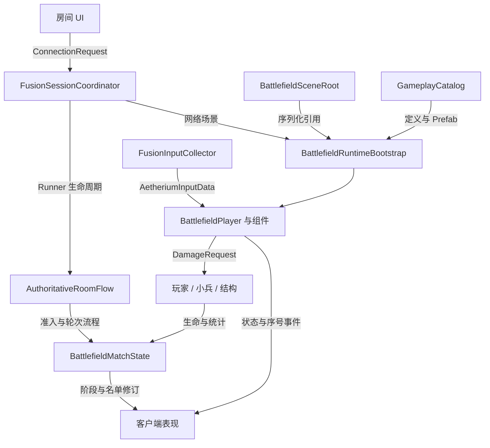
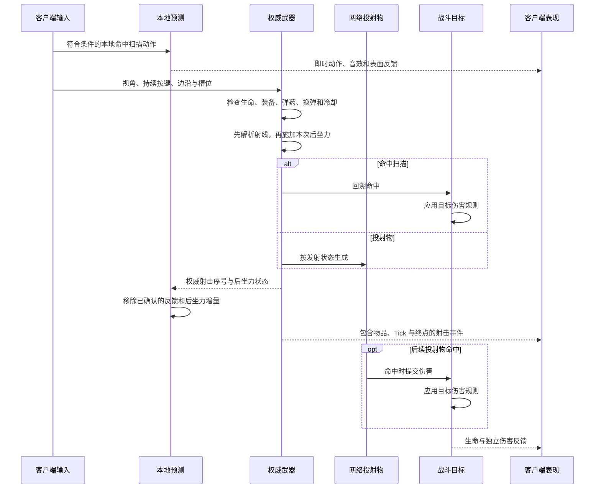
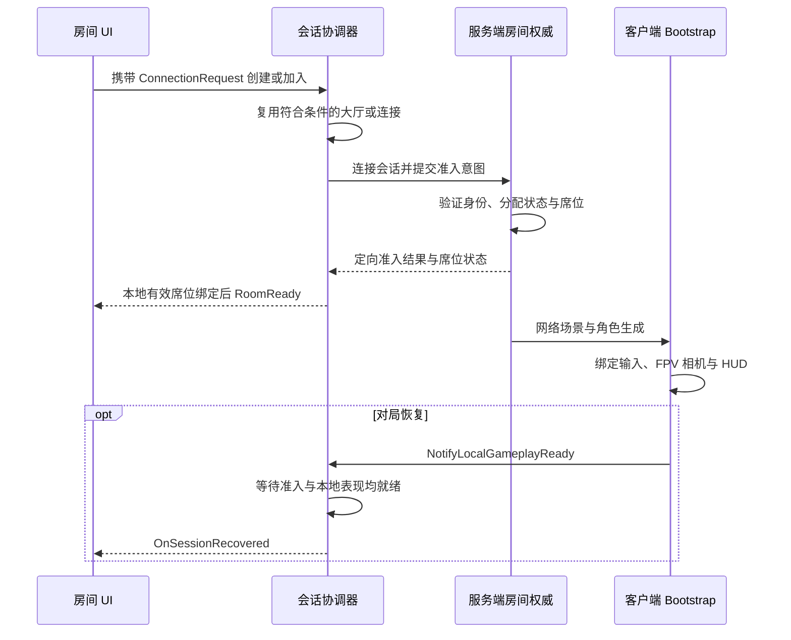
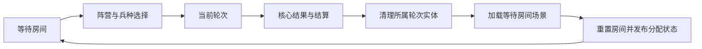
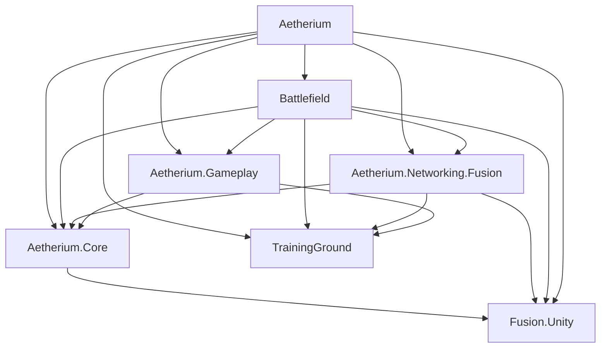

# 整体架构

[English](architecture.md) · [技术知识图谱](knowledge-map.md) · [系统契约](system-contracts.md) · [项目首页](../README.zh-CN.md)

Operation Aetherium 使用 Photon Fusion 2 的 **客户端 / 专用服务器架构**。服务端维护共享战斗和房间状态，客户端提交输入、预测本地移动及部分命中扫描反馈，并呈现复制结果。

架构为状态指定写入者，为动作指定时钟与身份，并为资源指定负责清理的生命周期。

## 网络拓扑

连接 Photon 服务与连接游戏服务器是不同环节。协调器管理连接尝试，游戏链路具有直连或中继路线。传输会话已连接之后，房间层仍需确认玩家准入和席位。

## 运行时装配

房间层管理准入和对局转换，能够独立于 UI 实例运行。场景根节点提供配置引用，Bootstrap 连接场景、会话和内容上下文，生成角色并维护绑定。运动、库存、武器、生命和能力由各自组件处理，表现层消费其输出。

## 状态所有权

| 状态 | 所有者 / 写入者 | 消费方式 |
|---|---|---|
| 持续按键、输入边沿与绝对视角 | 本地输入采集器 | Fusion 仿真与即时反馈 |
| 角色运动 | 服务端状态权威、本地输入权威预测 | 位置校正与远端运动 |
| 弹药、换弹、冷却、生命与能力消耗 | 对应玩法组件的状态权威 | 复制状态与 UI |
| 已接受射击与持续瞄准后坐力 | 权威武器控制器 | 命中查询、客户端协调与表现 |
| 本地待确认射击反馈和后坐力增量 | 本地预测层 | 即时反馈，按确认序号协调 |
| AI 决策、导航与目标推进 | 服务端状态权威 | 复制运动、攻击与目标显示 |
| 席位、准入、换兵种版本与轮次 | 权威比赛状态及房间流程 | 注册、生成、UI 与恢复 |
| 相机、动画、音效、特效和显示缓存 | 本地表现组件 | 各端的视听结果 |
| 参数与资源映射 | Definition 与 Catalog 资产 | 运行时装配和查询 |

## 战斗数据流

[AetheriumInputData](../src/Core/Models/AetheriumInputData.cs) 分离持续按键和累计按下 / 松开边沿。运动与瞄准共享绝对 yaw / pitch。权威命中扫描使用眼部原点与玩法视角，序列化枪口提供视觉发射位置。射线忽略 Trigger，自身过滤按射击者对象的子树判断。

有效射击序号参与确定性散布。[WeaponAimRecoil](../src/Core/Models/WeaponAimRecoil.cs) 根据武器身份和射击序号采样瞄准增量，应用 ADS 比例并约束俯仰范围。服务端先结算本次射线，再累加后坐力。本地视角结合最新权威偏移与未确认增量，收到确认后移除已经计入的增量，代次用于识别状态重置。

### 持续状态与瞬时事件

弹药、生命和计时描述当前事实，射击与命中描述发生过的动作。当前实现分别维护 **16 项射击事件环和 16 项伤害反馈环**，各自具有序号和消费游标。延迟命中的投射物因此能够独立标识伤害反馈。

[射击事件契约](../src/Battlefield/Player/WeaponPresentationEvent.cs) 保存开火时的物品、Tick、弹药结果和射线。库存提前切换时，历史射击仍按事件中的物品播放。固定窗口限制遍历，跳段诊断记录被覆盖的历史；生命和弹药结果由持续状态保留。

本地命中扫描预测检查当前装备、开火就绪、本地射击间隔与未确认弹药数量，产生动作、音效、曳光和表面反馈。伤害及命中确认由权威路径产生。预测先到和确认先到都检查已消费序号，避免同次反馈重复播放。

### 武器阶段与表现

装备过程分别判断资源就绪和可开火姿态。定义提供开火阈值，权威计时和 FPV 桥接均执行门控。切枪保留旧武器射击恢复与新武器装备锁定中较长的时间。

换弹明确发布 Started / Applied / Complete / Cancel 阶段。Serum 拉栓、释放与收尾期间锁定切换，释放时保存发射原点和方向。确认动作到达时若枪模仍在装备，桥接保留该次挂载适用的最新动作，音效在确认时处理。切枪、死亡、失去输入权及退出会话清理等待状态。[表现案例](cases/presentation-lifecycle.md)

[DamageRequest / DamageResult](../src/Core/Models/DamageRequest.cs) 与 [IFusionCombatTarget](../src/Core/Interfaces/IFusionCombatTarget.cs) 将攻击接入玩家、小兵和结构，各目标维护自己的结算规则。

## 准入、连接与恢复

[ConnectionRequest](../src/Core/Interfaces/ConnectionRequest.cs) 为一次用户动作提供操作 ID、单调截止时间、取消、进度阶段和唯一终态。当前策略在 60 秒总预算内最多尝试两次，并分配传输及准入预算。这些数值是配置上限。

协调器持有健康大厅连接，可以将符合条件的 Runner 转交给入房流程。重试策略区分网络失败、业务拒绝和主动取消，每次尝试使用独立协议 / 端口配置。操作 ID、尝试次数与 Runner 代次为异步结果提供归属上下文。

连接令牌关联返回的参与者，PlayerRef 标识当前传输连接。席位保留与恢复就绪流程协调这两类身份。协调器管理传输顺序，房间层通过契约提供席位握手。[会话案例](cases/session-lifecycle.md)

## 轮次与角色生命周期

同一服务器在多局之间保留房间。分配状态区分空闲、已认领、保留和重置中；AllocationEpoch、Runner 身份与 RoundId 将准入和对局工作限定在所属生命周期。

返回房间流程在异步加载前后检查归属。RoundSpawnLedger 记录轮次实体，使玩家、小兵和投射物的生命周期与服务进程分开处理。等待场景成为活动场景之后，才能重置房间状态。[专服案例](cases/dedicated-server.md)

基地换兵种属于局内角色替换。服务端检查请求来源、轮次、替换版本、存活、阵营区域、脱战时间、动作与冷却条件。Bootstrap 暂存新角色并转移状态，再提交席位及玩家对象绑定，最后销毁旧角色。[换兵种案例](cases/class-change.md)

## AI 与目标推进

FusionMinion 在权威侧执行目标选择、战斗与 NavMesh 移动。路线点给出推进目标，导航执行路径，复制速度驱动远端动画。目标有效性、距离和视线分别参与判断。

FusionStructure 分别维护目标前置条件与战斗 / 防护状态，FusionObjectiveRegistry 解析目标 ID。防御塔处理索敌和仇恨，核心摧毁产生比赛结果。[MOBA 案例](cases/moba-battlefield.md)

## 内容、程序集与资源

GameplayCatalog 将阵营 / 职业组合、物品 ID、能力 ID 和网络内容 ID 映射到定义与 Prefab。序列化列表供编辑，字典供运行时查询。WeaponDefinition 组织仿真与表现参数，包括后坐力和装备开火阈值。[内容案例](cases/content-architecture.md)

下图箭头表示 **程序集引用**。

| 程序集 | 责任 |
|---|---|
| Aetherium.Core | ID、契约、定义和目录，使用 Fusion 数据类型 |
| Aetherium.Networking.Fusion | 会话协调、连接策略、输入和玩家注册 |
| Battlefield | 玩家仿真、战斗、房间 / 比赛权威、AI 与装配 |
| Aetherium.Gameplay | 玩法及表现适配 |
| Aetherium | 场景与 UI 跨系统接入 |
| TrainingGround | 集成的 FPS 框架基础，归属见 [Credits](../CREDITS.md) |
| Editor / Tests | 资源接线、构建和专项验证工具 |

玩法接入在需要的位置引用 Fusion、Input System、动画、UI 和 URP，程序集图对应实际 Unity 依赖。

场景持有命中特效池及瞬时特效池，限制保留实例并在禁用时取消预热。物理缓冲、绑定缓存及序号 / 修订检查减少重复工作。Serum 查询达到复用缓冲上限后采用完整查询，保留密集区域的目标处理完整性。[资源管理案例](cases/runtime-resources.md)

## 构建与生命周期

DedicatedServerBuildTools 根据启用场景生成 Windows Player 和 Server 两类构建，并恢复编辑器设置。服务端工具提供配置启动、停止、就绪检查、防火墙及自动维护入口。进程身份和构建兼容性属于发布边界。

| 阶段 | 责任 |
|---|---|
| Awake / OnEnable | 准备本地引用和注册 |
| Spawned | 网络上下文、权威初始化和表现基线 |
| FixedUpdateNetwork | 权威 / 预测仿真与 TickTimer |
| Render 及本地帧阶段 | 消费快照、协调反馈和呈现 |
| Despawned / OnDisable / OnDestroy | 解绑、取消等待工作和释放资源 |

[系统契约](system-contracts.md)将模块职责连接到输入、输出与生命周期规则，[源码节选](../src/README.md)展示对应实现。
