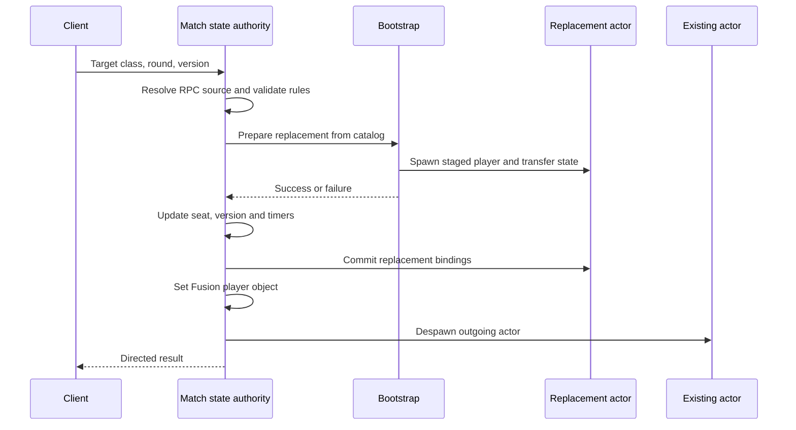

# Base class change: authoritative player replacement

[Gameplay](../gameplay.md) · [Architecture](../architecture.md) · [Source](../../src/README.md)

*Base class panel → Medic selection → confirmation → continued gameplay.* [Gameplay](../demo.md#base-class-change)

## Requirement

A player can change tactical role inside the team's base. The new class has its own prefab, health scale and ability, while the ongoing match retains the player's equipment, damage history and statistics. A class change must follow the current round's rules and preserve the state that belongs to the participant.

## Admission and identity

The client submits target class, RoundId and the current class-change version. [BattlefieldMatchState.ClassChange](../../src/Battlefield/Match/BattlefieldMatchState.ClassChange.cs) derives the requester from RPC source, resolves its persistent seat and validates:

- InMatch stage, a playable target class and a connected / locked seat.
- Matching round and class-change version.
- The current live player and its input authority.
- Membership in the team's [geometric base zone](../../src/Battlefield/Runtime/BattlefieldClassChangeZone.cs).
- The out-of-combat timer, change interval and weapon action lock.
- Required replacement resources.

The current rules require three seconds since actual damage and five seconds between successful changes. Each persistent seat processes at most two requests per second, including rejected requests. Results are directed to the requester. A same-class request does not refresh state.

## Staging and commit

[BattlefieldRuntimeBootstrap.ClassChange](../../src/Battlefield/Runtime/BattlefieldRuntimeBootstrap.ClassChange.cs) preloads the configured team / class prefabs, checks required components and stages the new actor. It transfers state before success is returned. If preparation throws, it removes the staged actor and retains the original.

The match layer commits the seat and player-object bindings after preparation succeeds, then despawns the old player. Binding teardown is scoped to its owning actor.

## State transfer policy

| State | Implemented policy |
|---|---|
| Health | Preserve health ratio against the new maximum |
| Damage / healing contribution | Scale damage contributions with maximum health; retain healing attribution |
| Regular inventory | Retain regular weapons and ammo |
| Position and movement | Preserve position, orientation, stance and applicable movement effects |
| Weapon timing | Retain recovery, spread and aim recoil; equip lock can extend firing readiness |
| Reload | Cancel outgoing intermediate work without crediting unsettled ammo |
| Serum effects | Retain applicable effect and immunity timers |
| Class shield and special item | End outgoing class-specific state |
| Ability cooldown | Keep shared cooldown in the match seat; cancellation of an active ability uses the outgoing ability's cooldown rule |
| Statistics | Retain kills, deaths, assists, minion kills, score and attribution |

Serum preparation, release and follow-through lock replacement. Healing and blocked / zero damage do not start the damage-based out-of-combat timer. Persistent-seat cooldown and version state remain available across reconnection; round reset clears round-owned state.

## 工程要点

这项功能把角色对象与对局参与者分开建模：对象可以替换，席位身份和统计继续存在。请求带轮次和版本，权威解析真实来源，状态转移先于绑定提交。血量比例、弹药、伤害贡献和技能冷却分别遵循其语义，保持局内连续性。
