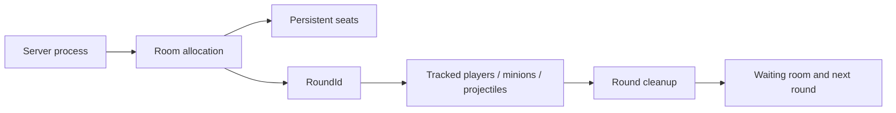

# Dedicated server: room ownership across matches

[Architecture](../architecture.md) · [会话流程](session-lifecycle.md) · [系统契约](../system-contracts.md)

## Requirement

A server process needs to run room and match rules without a player's UI. Transport connection, seat admission, a running round and local player presentation have different completion conditions. A room also needs to return to a usable waiting state while the server remains alive.

## Implementation

Fusion runs the headless game process as GameMode.Server and players as clients. AuthoritativeRoomFlow owns MatchState creation, admission, seat release, allocation publication and the return-to-room flow. UI binds the resulting state.

The dedicated session exposes allocation state: **Idle, Claimed, Reserved, Resetting**. Creating a room claims an available allocation. The initial room administrator is a room permission; gameplay state authority stays with the server. Stable connection tokens map participants to seats, while PlayerRef identifies their current connection. AllocationEpoch scopes admission to the allocation being joined.

RoundId scopes a match within that room. RoundSpawnLedger records round entities. After settlement the authority checks Runner, MatchState and round identity, cleans the tracked round, requests the waiting-room scene, waits for it to become active, then resets replicated room state and publishes the allocation. Ownership is checked again after the asynchronous load.

This separates process lifetime, allocation lifetime, seat identity and round entities. A late callback can be evaluated against the context it was created for.

## Build and operation tooling

DedicatedServerBuildTools builds Windows Player and Server subtargets from the enabled scene list, checks the bootstrap scene order and restores editor settings in a finally block. The server package includes configuration and launch dependencies.

The server tools implement:

- Configured room name, UDP listen port and advertised public IPv4 through [ServerLaunchOptions](../../src/Core/Network/ServerLaunchOptions.cs).
- Launch / stop ownership by the packaged executable path, with a shared operation lock.
- Readiness inspection using process identity, UDP listening state and the matching ServerReady log.
- Explicit firewall and autostart entry points, with a persistent pause marker for intentional stops.
- Separate capacity collection utilities for timestamped CPU, memory and network samples.

Build compatibility and process ownership are checked explicitly. [ServerLaunchOptions](../../src/Core/Network/ServerLaunchOptions.cs) centralizes the launch argument contract.

## 工程要点

房间权限、游戏状态权威与服务器进程分别承担责任。准入和分配代次处理“谁能进入当前房间”，轮次账本处理“哪些对象属于这一局”，等待场景就绪门控处理“何时可以重置”。因此连续对局、恢复和清理具有明确的归属与时序。
