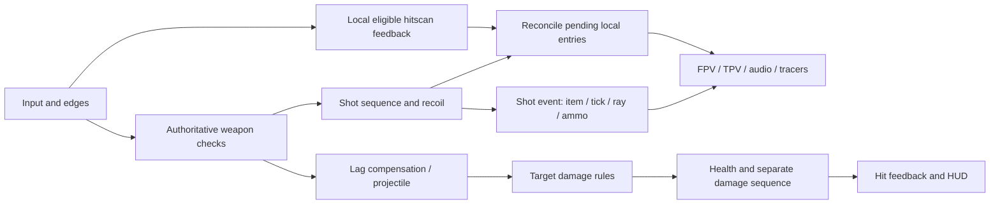

# Networked combat: responsive feedback with authoritative results

[Architecture](../architecture.md) · [Presentation lifecycle](presentation-lifecycle.md)

*Aiming, firing and reload in a shared battlefield.* [Gameplay](../demo.md#squad-combat)

## Requirement

Local firing needs feedback at the action boundary. Damage needs a shared decision. A projectile can hit after newer shots, and a render frame can observe confirmation before its local predictor has run. Each action therefore needs identity, timing and ownership.

## Implementation

[AetheriumInputData](../../src/Core/Models/AetheriumInputData.cs) carries movement, absolute yaw / pitch, held buttons, accumulated edges and slot selection. FusionPlayerMotor simulates on state authority and input authority. FusionWeaponController advances shared ammo, reload, cooldown, throw and recoil state on authority.

Hitscan uses Fusion lag compensation from the gameplay eye ray. The query excludes triggers and the shooter's own actor subtree. Spread is seeded by accepted shot sequence and pellet index. The muzzle supplies the visible firing origin; gameplay view supplies the damage ray.

## Aim recoil

[WeaponAimRecoil](../../src/Core/Models/WeaponAimRecoil.cs) samples the kick from weapon identity and shot sequence. ADS scales it; pitch clamping respects the view bounds. A shot resolves its ray **before adding its own kick**, so that increment affects subsequent aim.

Authority stores the accepted offset. The local predictor stores up to 64 pending entries, each identified by sequence. Displayed aim combines the authority offset and pending kicks; reconciliation removes entries already confirmed. A generation change resets the pending baseline. Snapshots replace the authority contribution rather than adding it again.

## Local and confirmed feedback

Eligible local hitscan firing checks equipped item, firing readiness, local cadence, reload and remaining clip after unconfirmed shots. Immediate feedback includes fire motion, sound, tracers and surface impacts. The authority resolves damage separately.

Prediction and confirmation share shot-sequence identity:

- A prediction-first confirmation reconciles ammo and gameplay feedback while suppressing the already played fire response.
- A confirmation-first action advances the local producer without adding duplicate sound, motion, tracer or ammo debt.
- Weapon changes, refills, death and ownership changes clear the relevant local state.

Remote feedback and projectiles remain confirmation-driven. [WeaponShotPresentationEvent](../../src/Battlefield/Player/WeaponPresentationEvent.cs) retains item ID, shot tick, ammo result and the authoritative ray, so playback remains tied to the action even after inventory switches.

## Persistent state and delayed hits

Shot and damage-feedback rings each hold 16 entries. Consumers track sequence windows; unchanged sequences skip traversal, and gaps are recorded for diagnosis. Damage feedback has a separate identity because a projectile impact can occur after its shot event.

[DamageRequest / DamageResult](../../src/Core/Models/DamageRequest.cs) and [IFusionCombatTarget](../../src/Core/Interfaces/IFusionCombatTarget.cs) retain attack context and give players, minions and structures a common boundary. Each target applies its own damage rules. Health and ammo persist independently of recent feedback history.

## 工程要点

输入、有效射击、实际伤害和本地播放各有对应数据。射击序号关联预测与确认，独立伤害序号处理延迟命中，后坐力代次处理重置。这样一次交火可以沿“意图 → 规则 → 结果 → 反馈”定位，而播放窗口和持久状态也各自承担明确责任。
