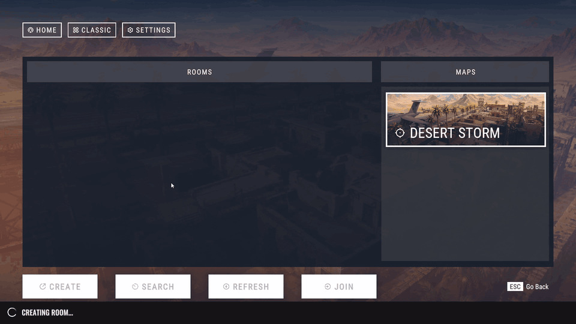
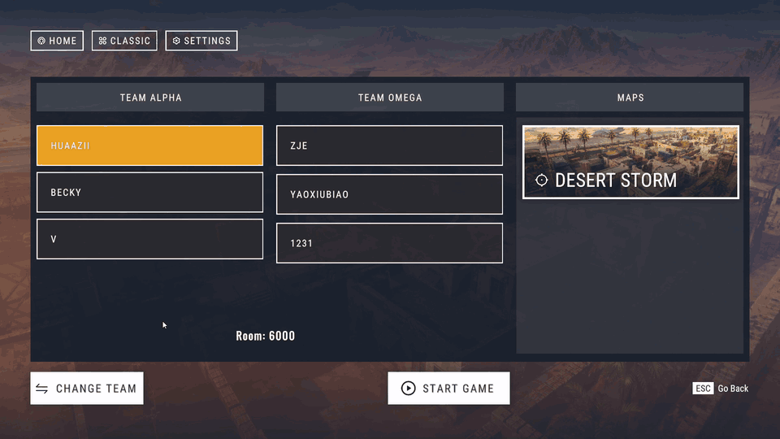
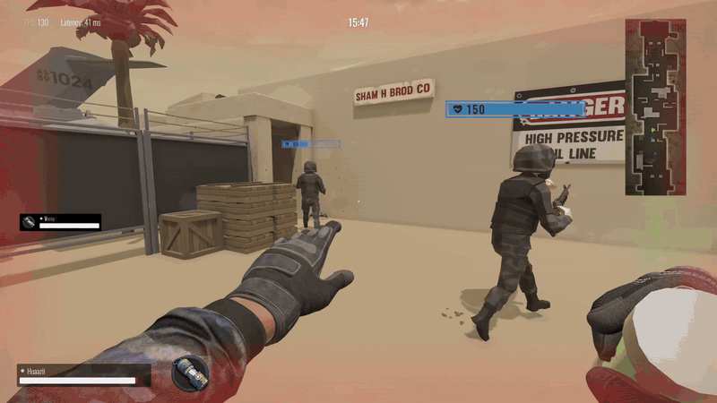
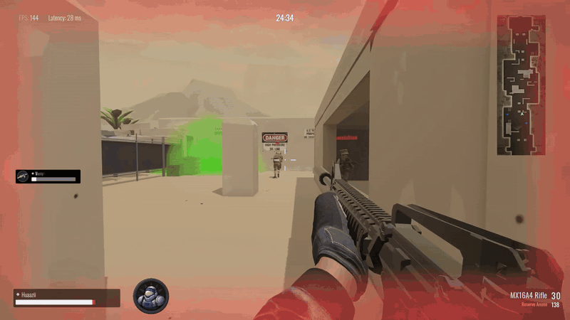
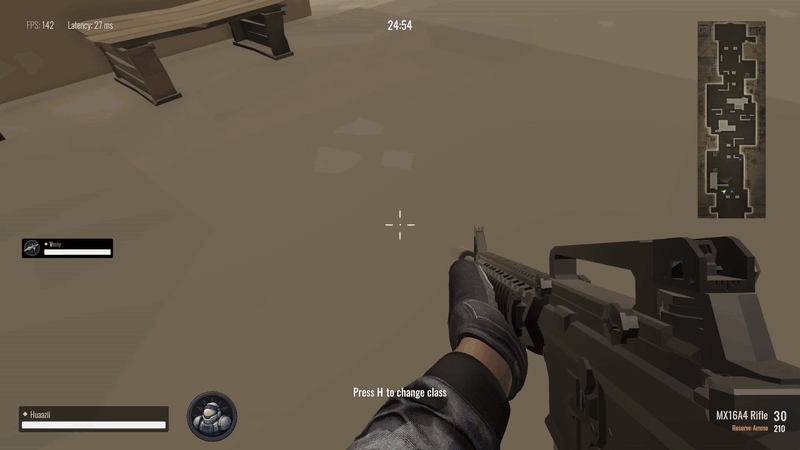
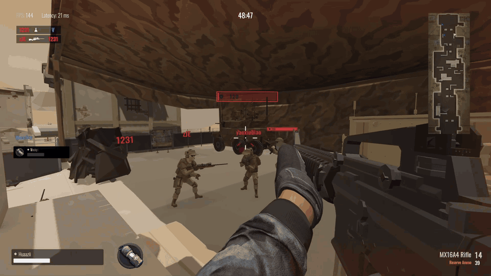

# Multiplayer gameplay

[Project](../README.md) · [中文](demo.zh-CN.md) · [Architecture](architecture.md)

Desert Storm combines first-person combat, class cooperation and MOBA objective progression in a 3v3 match.

## Squad combat

Rifle aiming and reload operate alongside other players, defensive structures and area effects. Authoritative hitscan determines damage; local feedback and sequence reconciliation connect that result to the player's first-person weapon.

[Combat simulation and prediction](cases/networked-combat.md) · [Weapon presentation](cases/presentation-lifecycle.md)

## Room and class selection

Room admission binds each participant to a persistent seat. Team changes update the shared roster that drives the room interface.

Class identity selects the character and ability configuration. Locking the selection connects room state to battlefield spawning.

[Session and room ownership](cases/dedicated-server.md) · [Content configuration](cases/content-architecture.md)

## Class abilities

### Medic: Serum support

Serum combines timed throw stages with an area that heals allies and damages enemies. The weapon returns to its regular presentation after release, while the area follows its own gameplay lifetime.

[Ability rules](gameplay.md#当前兵种) · [Action and mount lifetimes](cases/presentation-lifecycle.md)

### Heavy: shield

Heavy's shield has an authoritative duration and damage-reduction state. The local screen effect presents the active ability during movement and weapon use.

[Gameplay](gameplay.md#当前兵种) · [State ownership](architecture.md#state-ownership)

## Base class change

A living player can change tactical role at the team's base. The server validates the request and stages a replacement actor, preserving participant-owned health ratio, ordinary equipment, effects and statistics.

[Request validation and state transfer](cases/class-change.md)

## Match settlement

The match outcome connects battlefield progression to Victory and squad statistics. Players, minions and structures share combat-target contracts; objectives define the route to the opposing core.

[AI and objective progression](cases/moba-battlefield.md) · [Round lifecycle](cases/dedicated-server.md)

## Desert Storm battlefield

Lanes, cover and defensive structures give combat and AI navigation a shared spatial context.

[Battlefield systems](cases/moba-battlefield.md)
