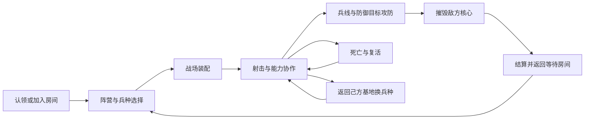

# Gameplay and world / 玩法与世界观

[Project](../README.md) · [中文首页](../README.zh-CN.md) · [联机实录](demo.zh-CN.md) · [Architecture](architecture.md)

Operation Aetherium combines an FPS firefight with MOBA objective progression. Alpha and Omega fight over a desert outpost: class abilities create openings, minions sustain pressure, and defensive structures shape the route toward the opposing core.

## 源晶争夺

近未来，一座废弃沙漠军事哨站下发现了高能晶体 Aetherium。矿区磁场干扰限制大型载具、航空装备和远程通讯，争夺集中在进入哨站的地面小队之间。

Alpha 得到能源企业支持，任务是控制矿脉并保护开采设施。Omega 由独立佣兵组成，希望打破资源垄断，夺取矿区主导权。核心是双方控制矿区的支点，防御塔维持各自的控制范围。

Desert Storm 用围墙、集装箱、通道与基地组织战场。沙色环境形成整体氛围，掩体、角色轮廓和阵营识别服务交战判断。这段世界观提供叙事背景，以下系统对应游戏实现。

## 对局闭环

3v3 小队通过射击、移动和能力取得局部空间，再配合小兵将压力转化为结构推进。核心将这些交锋连接到整局胜负。同一服务器保留房间，结算后回到等待状态继续对局。

## 当前兵种

| 兵种 | 团队任务 | 已实现系统 |
|---|---|---|
| Heavy | 防护与正面交战 | 权威护盾状态、持续时间、减伤和能力生命周期 |
| Medic | 区域支援 | Serum 装备授予、投掷释放、友方治疗与敌方伤害区域 |
| Rocket | 爆发火力 | RPG 装备、网络投射物、爆炸反馈与消耗后的装备切换 |

阵营身份与职业身份分别建模。角色生成、库存、生命和表现使用公共接口；职业配置与对应能力形成差异。

## 基地换兵种

存活玩家在己方基地区域按 **H** 打开兵种面板，确认后原地替换为所属阵营的目标角色。实际伤害后的三秒脱战条件、五秒切换间隔和投掷动作锁定共同约束确认。

更换保留血量比例、普通武器与弹药、运动状态、适用的 Serum 效果和战斗统计。技能冷却保存在比赛席位，旧职业专有状态按规则结束。请求包含轮次与版本，由服务端验证来源和区域后执行。[状态转移实现](cases/class-change.md)

## 战斗与战场

命中扫描武器使用权威回溯判定，本地反馈预测提供动作、音效和表面表现。投射物发射与命中分别产生射击及伤害反馈。换弹、装备与投掷使用各自阶段和计时。

小兵按波次生成，在权威侧执行导航、目标选择和攻击，客户端呈现复制运动。结构分别维护目标前置关系、战斗与防护状态；防御塔处理目标和仇恨，核心承接最终胜负条件。

[战斗机制](cases/networked-combat.md) · [兵线与结构](cases/moba-battlefield.md) · [联机玩法展示](demo.zh-CN.md)
