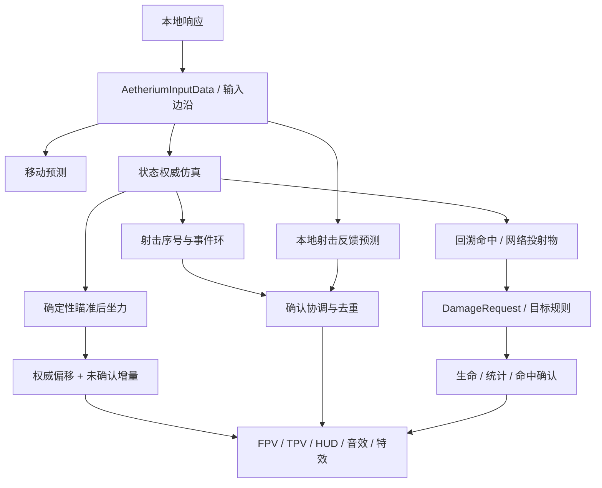
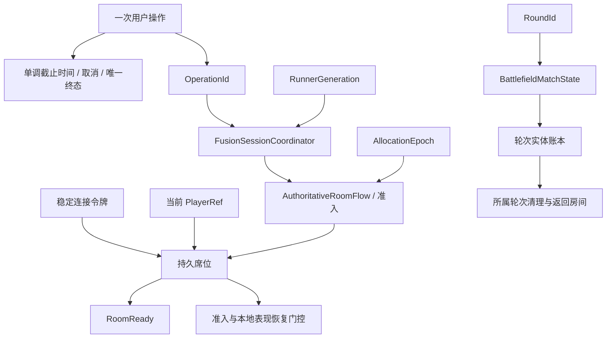
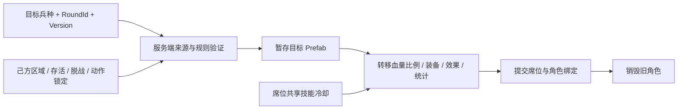
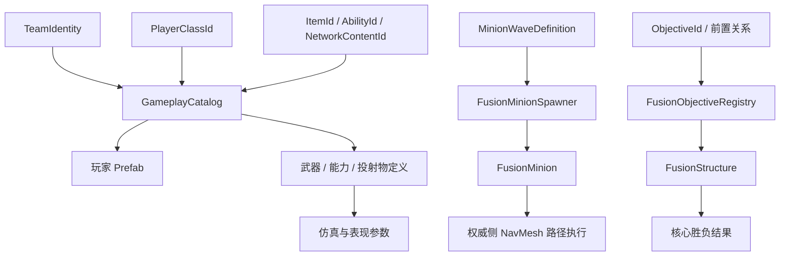
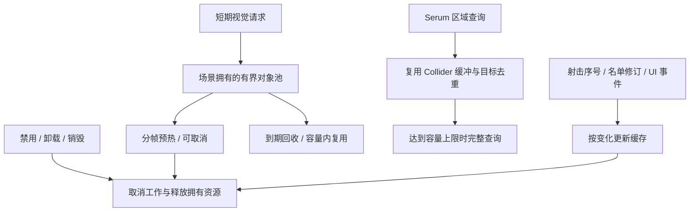

# Technical knowledge map / 技术知识图谱

[Project](../README.md) · [中文首页](../README.zh-CN.md) · [Architecture](architecture.md) · [系统契约](system-contracts.md)

Each graph connects a game requirement to a mechanism and its implementation. Arrows express relationships rather than inheritance.

## 操作响应与共享结果

| 知识点 | 具体问题 | 实现 |
|---|---|---|
| 输入语义 | 短暂点击与持续操作如何跨越网络 Tick | [输入数据](../src/Core/Models/AetheriumInputData.cs)分离状态和边沿 |
| 预测与权威 | 操作时即时反馈，随后与服务端结果对应 | 本地命中扫描反馈、未确认弹药计数和序号协调 |
| 确定性与时间顺序 | 同次射击在各端使用可对应的瞄准增量 | [WeaponAimRecoil](../src/Core/Models/WeaponAimRecoil.cs)，先射线、后增量 |
| 持续状态与事件 | 当前弹药与历史射击分别如何表达 | [事件契约](../src/Battlefield/Player/WeaponPresentationEvent.cs)、独立 16 项事件环和消费游标 |
| 接口与实体规则 | 同次攻击能够作用于玩家、小兵或结构 | [目标接口](../src/Core/Interfaces/IFusionCombatTarget.cs)与[伤害契约](../src/Core/Models/DamageRequest.cs) |

[战斗案例](cases/networked-combat.md) · [表现阶段](cases/presentation-lifecycle.md)

## 异步连接、房间与轮次

| 知识点 | 项目用途 | 实现 |
|---|---|---|
| 异步所有权 | 完成回调属于哪个用户请求、哪个网络实例 | 操作 ID、Runner 代次和取消检查 |
| 单调时钟与预算 | 连接、重试、准入共用一个等待边界 | [ConnectionRequest](../src/Core/Interfaces/ConnectionRequest.cs) |
| 身份分层 | 玩家返回时传输引用变化，席位仍需对应 | ConnectionToken、PlayerRef 与服务器准入 |
| 状态机与生命周期 | 服务进程、房间分配与一局实体寿命不同 | 分配状态、轮次身份和 RoundSpawnLedger |
| 就绪语义 | 已连接、已准入、已绑定本地表现各有条件 | RoomReady 与恢复阶段的 GameplayReady 门控 |

[专服案例](cases/dedicated-server.md) · [会话案例](cases/session-lifecycle.md)

## 局内角色替换

角色替换结合了 **服务器可信边界、乐观版本校验、分阶段提交和资源生命周期**。[请求逻辑](../src/Battlefield/Match/BattlefieldMatchState.ClassChange.cs)决定是否合法，[Bootstrap](../src/Battlefield/Runtime/BattlefieldRuntimeBootstrap.ClassChange.cs)暂存与转移，[区域组件](../src/Battlefield/Runtime/BattlefieldClassChangeZone.cs)提供几何条件。具体继承规则见[案例](cases/class-change.md)。

## 内容身份、AI 与目标

[内容配置](cases/content-architecture.md)说明身份、参数与资源映射的分工；[MOBA 案例](cases/moba-battlefield.md)说明决策、导航、战斗门控和目标结果的关系。职业身份与席位容量独立，当前职业校验和预加载范围明确覆盖 Heavy、Medic、Rocket。

## 更新成本与场景资源

这些机制将 **存储上限、重复查询、对象分配和清理归属** 变成可检查的实现条件。[资源管理案例](cases/runtime-resources.md)给出池容量、回收策略与密集查询的处理边界。
